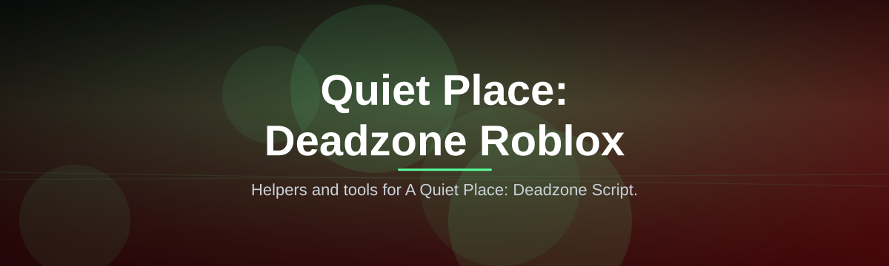

# A-Quiet-Place-Deadzone-Script-2602

Helpers and tools for A Quiet Place: Deadzone Script.

  

## Overview

Helpers and tools for A Quiet Place: Deadzone Script.

## License

[MIT License](LICENSE)
